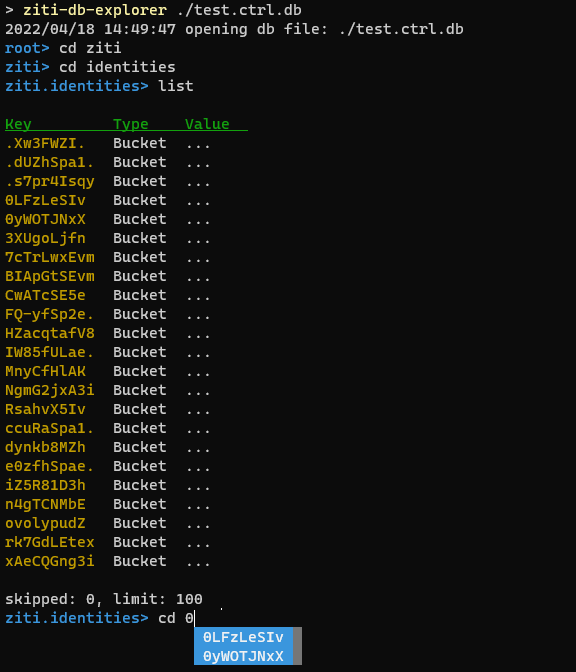

# ziti-db-explorer
OpenZiti controllers rely upon [bbolt](https://github.com/etcd-io/bbolt) for lightweight embedded data storage. A bbolt
database is a key value store where both keys and values are treated as opaque byte arrays. OpenZiti's 
[storage.boltz](https://github.com/openziti/storage) library adds types to the base bbolt implementation. While other
tools exist to explore raw bbolt database files, they do not know of OpenZiti's type system.



[//]: # (This tool is also included in the `ziti` CLI under `ziti db explore` in version 0.25.5 and later)

# Installation

> go install github.com/openziti/ziti-db-explorer/cmd/ziti-db-explorer/...@latest

# Building From Source

> git clone https://github.com/openziti/ziti-db-explorer.git
> go build ./...

# Installing from Source

> git clone https://github.com/openziti/ziti-db-explorer.git
> go install ./...

# Usage

```
'ziti-db-explorer' is an interactive shell for exploring Ziti Controller database files

Usage:
        ziti-db-explorer <ctrl.db> [-h]
```

# Commands

All commands support tab completion. 

```
root> help
command       description
back          go back one bucket level (alias b)
cd            enter a bucket
clear         clear the console
count         number of keys in bucket
help          prints help
list          list keys, supports --skip <x> --limit <y>
list-all      list all keys
pwd           print the full path
quit          leave this horrible place
root          return to the root node (alias r)
show          print the full value of a key
stats-bucket  show stats for the current bucket
stats-db      show stats for the db
```

# Embedding

This repository contains two go modules that are intended for import:

- `./cmd/ziti-db-explorer/zdecli` - The `Run()` method is exposed in order to make the entire CLI embeddable in other tools
- `./zdelib` - Provides low level access to bbolt and boltz primitives to create your own tools